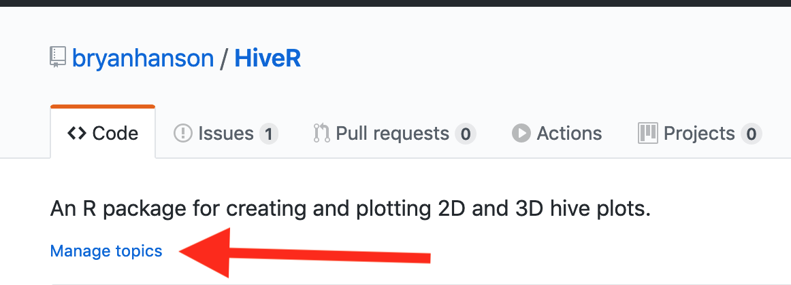

As the code driving
[FOSS for Spectroscopy](https://bryanhanson.github.io/FOSS4Spectroscopy/) has matured, I began to think about how to explore Github in a systematic way for additional repositories with tools for spectroscopy.  It turns out that a Github repo can have topics assigned to it, and you can use the Github API to search them. Wait, *what?* I didn't know one could add topics to a repo, even though there is a little invite right there under the repo name:



Naturally I turned to StackOverflow to find out how to do this, and quickly encountered this [question](https://stackoverflow.com/a/48412541/633251).  It was asked when the topics feature was new, so one needs to do things just a bit differently now, but there is a way forward.

Before we get to implementation, let's think about limitations:

* This will only find repositories where topics have been set.  I don't know how broadly people use this feature, I had missed it when it was added.
* Github topics are essentially tags with a controlled vocabulary, so for the best results you'll need to manually explore the tags and then use these as your search terms.
* The Github API only returns [30 results](https://developer.github.com/v3/#pagination) at a time for most types of queries.  For our purposes this probably doesn't matter much.  The [documentation](https://developer.github.com/v3/guides/traversing-with-pagination/) explains how to iterate to get all possible results.
* The Github API also limits the [number of queries](https://developer.github.com/v3/#rate-limiting) you can make to 60/hr unless you authenticate, in which case the limit goes to 6000/hr.

Let's get to it! First, create a Github access token on your local machine using the instructions in this [gist](https://gist.github.com/bryanhanson/5d02c55b8e1178e84b7c119a7c6ca92b).  Next, load the needed libraries:

```{r hiddenSetup, echo = FALSE, eval = TRUE, results = "hide"}
# Clean the workspace but keep the token if present
keep <- "github_token"
library("knitr")
opts_chunk$set(eval = FALSE)
```

```{r setup}
set.seed(123)
library("httr")
library("knitr")
library("kableExtra")
```

Specify your desired search terms, and create a list structure to hold the results:

```{r terms}
search_terms <- c("NMR", "infrared", "raman", "ultraviolet", "visible", "XRF", "spectroscopy")
results <- list()
```

Create the string needed to access the Github API, then `GET` the results, and stash them in the list we created:

```{r results}
nt <- length(search_terms) # nt = no. of search terms
for (i in 1:nt) {
  search_string <- paste0("https://api.github.com/search/repositories?q=topic:", search_terms[i])
	request <- GET(search_string, config(token = github_token))
  stop_for_status(request) # converts http errors to R errors or warnings
  results[[i]] <- content(request)
}
names(results) <- search_terms
```

Figure out how many results we have found, set up a data frame and then put the results into the table. The `i`, `j`, and `k` counters required a little experimentation to get right, as `content(request)` returns a deeply nested list and only certain items are desired.

```{r organizeResults}
nr <- 0L # nr = no. of responses
for (i in 1:nt) { # compute total number of results/items found
	nr <- nr + length(results[[i]]$items)
}

DF <- data.frame(term = rep(NA_character_, nr),
  repo_name = rep(NA_character_, nr),
  repo_url = rep(NA_character_, nr),
  stringsAsFactors = FALSE)

k <- 1L
for (i in 1:nt) {
	ni <- length(results[[i]]$items) # ni = no. of items
	for (j in 1:ni) {
		DF$term[k] <- names(results)[[i]]
		DF$repo_name[k] <- results[[i]]$items[[j]]$name
		DF$repo_url[k] <- results[[i]]$items[[j]]$html_url
		k <- k + 1L
	}
}
# remove duplicated repos which result when repos have several of our
# search terms of interest.
DF <- DF[-which(duplicated(DF$repo_name)),]
```

Now put it all in a table we can inspect manually, send to a web page so it's clickable, or potentially write it out as a csv (If you want this as a csv you should probably write the results out a bit differently).  In this case I want the results as a table in web page so I can click the repo links and go straight to them.

```{r createTable}
namelink <- paste0("[", DF$repo_name, "](", DF$repo_url, ")")
DF2 <- data.frame(DF$term, namelink, stringsAsFactors = FALSE)
names(DF2) <- c("Search Term", "Link to Repo")
```

We'll show just 10 random rows as an example:

```{r printTable, results = "asis"}
keep <- sample(1:nrow(DF2), 10)
options(knitr.kable.NA = '')
kable(DF2[keep, ]) %>%
  kable_styling(c("striped", "bordered"))
```

<!-- Since authenticating to Github in the Hugo + Netlify environment is tricky, we'll insert the results of running the code above next.  That way the page looks correct w/o running the code. -->

<table class="table table-striped table-bordered" style="margin-left: auto; margin-right: auto;">
<thead>
<tr>
<th style="text-align:left;">
</th>
<th style="text-align:left;">
Search Term
</th>
<th style="text-align:left;">
Link to Repo
</th>
</tr>
</thead>
<tbody>
<tr>
<td style="text-align:left;">
31
</td>
<td style="text-align:left;">
infrared
</td>
<td style="text-align:left;">
<a href="https://github.com/pycroscopy/pycroscopy">pycroscopy</a>
</td>
</tr>
<tr>
<td style="text-align:left;">
79
</td>
<td style="text-align:left;">
ultraviolet
</td>
<td style="text-align:left;">
<a href="https://github.com/woudc/woudc-data-registry">woudc-data-registry</a>
</td>
</tr>
<tr>
<td style="text-align:left;">
51
</td>
<td style="text-align:left;">
infrared
</td>
<td style="text-align:left;">
<a href="https://github.com/eddyyanto/ir-repeater">ir-repeater</a>
</td>
</tr>
<tr>
<td style="text-align:left;">
14
</td>
<td style="text-align:left;">
NMR
</td>
<td style="text-align:left;">
<a href="https://github.com/cheminfo-js/spectra-data">spectra-data</a>
</td>
</tr>
<tr>
<td style="text-align:left;">
67
</td>
<td style="text-align:left;">
raman
</td>
<td style="text-align:left;">
<a href="https://github.com/professordeng/Raman-spectra">Raman-spectra</a>
</td>
</tr>
<tr>
<td style="text-align:left;">
42
</td>
<td style="text-align:left;">
infrared
</td>
<td style="text-align:left;">
<a href="https://github.com/furrtek/PrecIR">PrecIR</a>
</td>
</tr>
<tr>
<td style="text-align:left;">
50
</td>
<td style="text-align:left;">
infrared
</td>
<td style="text-align:left;">
<a href="https://github.com/jrsmile/esp32-room-control-panel">esp32-room-control-panel</a>
</td>
</tr>
<tr>
<td style="text-align:left;">
118
</td>
<td style="text-align:left;">
spectroscopy
</td>
<td style="text-align:left;">
<a href="https://github.com/nasa-jpl/LiveViewLegacy">LiveViewLegacy</a>
</td>
</tr>
<tr>
<td style="text-align:left;">
43
</td>
<td style="text-align:left;">
infrared
</td>
<td style="text-align:left;">
<a href="https://github.com/federicosanna/arduino-primo-tutorials">arduino-primo-tutorials</a>
</td>
</tr>
<tr>
<td style="text-align:left;">
101
</td>
<td style="text-align:left;">
XRF
</td>
<td style="text-align:left;">
<a href="https://github.com/archaeological-research-facility/web_geochemistry">web_geochemistry</a>
</td>
</tr>
</tbody>
</table>

Obviously, these results must be inspected carefully as terms like "infrared" will pick up projects that deal with infrared remote control of robots and so forth.  As far as my case goes, I have a lot of new material to look through...

A complete `.Rmd` file that carries out the search described above, and has a few enhancements, can be found at this [gist](https://gist.github.com/bryanhanson/e7736f4493571087438c6dfb353c6343).
